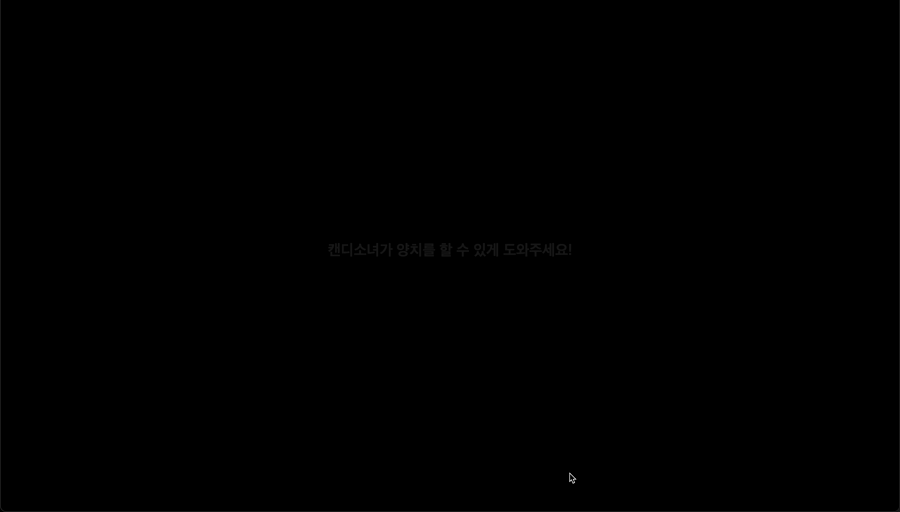
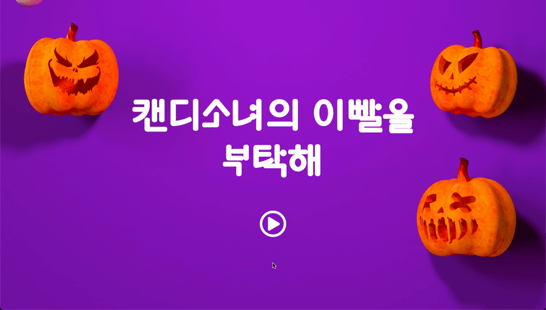
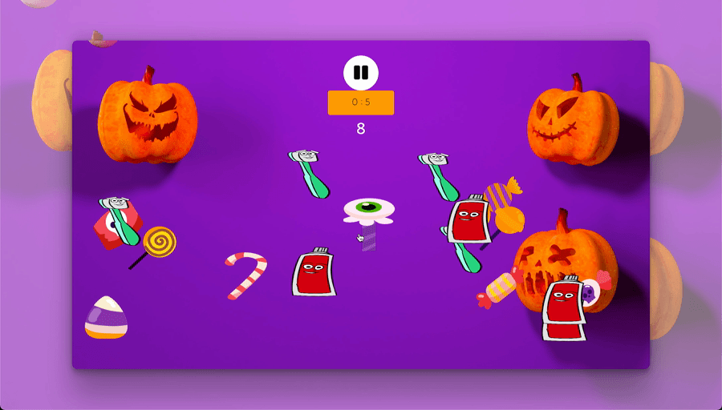
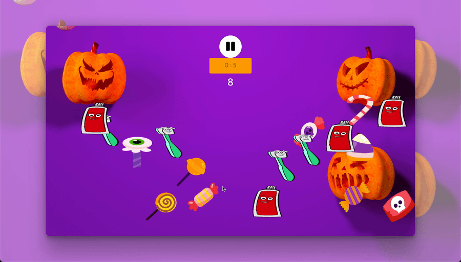
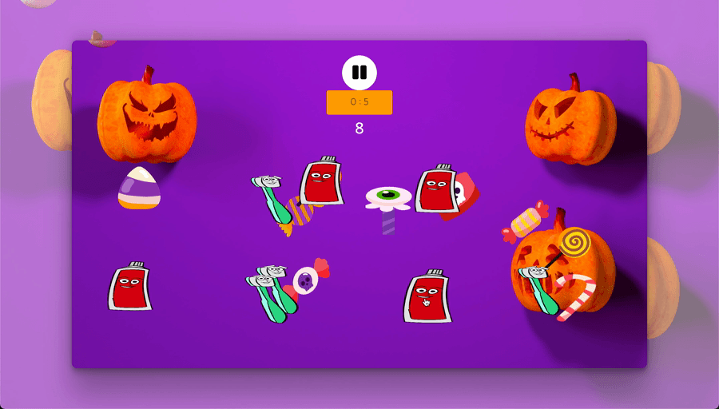
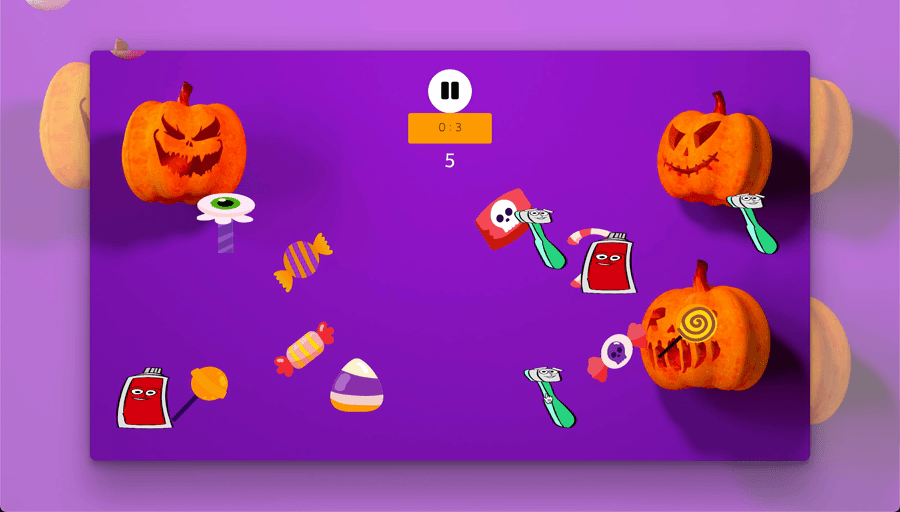

# Game - Halloween after

할로윈 이후, 캔디소녀의 뒷 이야기
  
## Use Tech

</a>
</a>
</a>
</a>
 

---
## 1. 초기화면
> CSS Animation 사용

 

---

## 2. javascript를 이용한 아이템 자리 배치
> Math.random을 이용해 아이템의 자리 배치

 

 

---

## 3. 게임 진행, 구현 해야 할 것들
1. setTimeout을 이용한 타이머 구현
2. 클릭 이벤트를 이용해 아이템 선택
3. 클릭 이벤트 발생시 카운트 발생
4. 게임 여부에 따라 결과 팝업 

|for game winner|game over|
|:-:|:-:|
| | |
 
---

## 4. 일시정지, 재시작 버튼
> 일시정지, 재시작 버튼을 클릭하면 아이템이 재배치 됩니다.

|게임 진행중 일시정지 | 게임 종료후 재시작|
|:-:|:-:|
|||

 

---

## 5. 사운드
>   js를 이용해 게임안에 효과음을 넣었습니다.